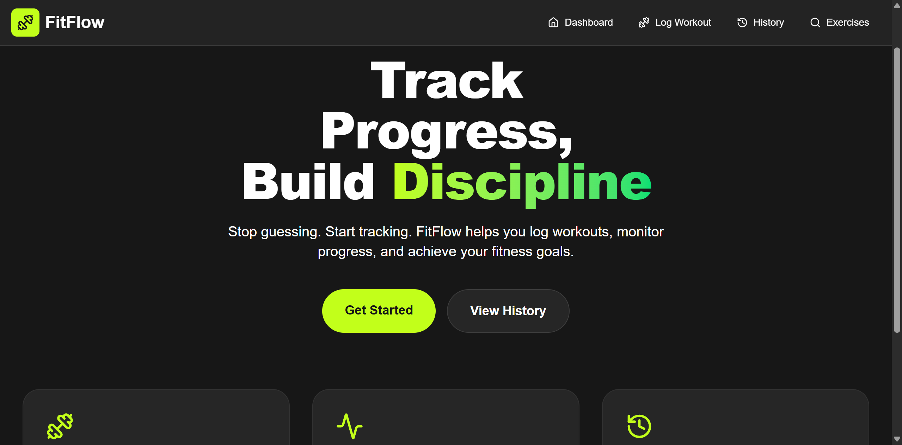
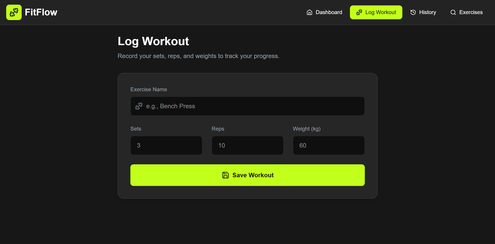
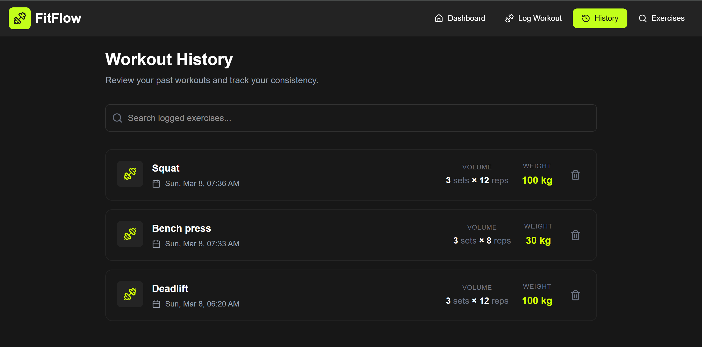
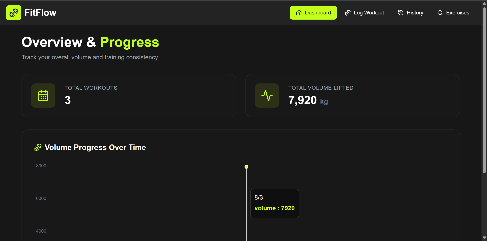
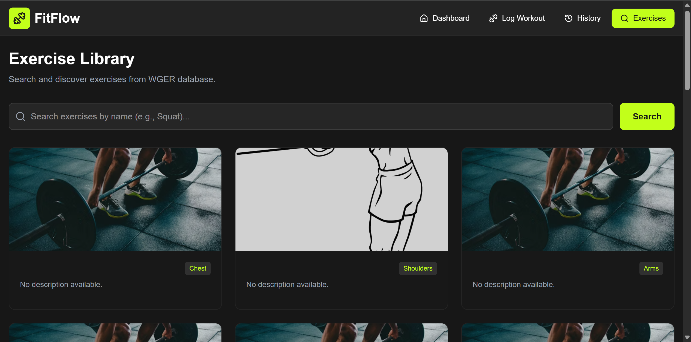

<div align="center">

#  FitFlow

**Track Progress. Build Discipline.**

> A modern, high-performance fitness tracking application built with React and Vite. Track workouts, monitor progress, and achieve your fitness goals with an intuitive, responsive interface.

[](https://fit-flow-gray.vercel.app/)


</div>


---

##  Features

- **Log Workouts** — Record exercises with sets, reps, and weight in seconds
- **Workout History** — View and search all your past sessions, delete entries you don't need
- **Progress Dashboard** — Visual charts tracking your total volume and consistency over time
- **Exercise Library** — Browse hundreds of exercises from the WGER API with images and muscle group tags
- **Persistent Storage** — Workouts are saved to `localStorage` so your data stays between sessions
- **Responsive Design** — Works on desktop, tablet, and mobile

---

##  Tech Stack

| Technology | Purpose |
|---|---|
| React 18 | UI components & state management |
| Vite | Build tool & dev server |
| Tailwind CSS | Styling & responsive layout |
| Recharts | Progress charts |
| WGER REST API | Exercise data (names, images, muscle groups) |
| localStorage | Client-side data persistence |

---

##  Screenshots

###  Home


###  Log Workout


###  Workout History


###  Dashboard & Progress Overview


###  Exercise Library


---


## 📁 Project Structure

```
FitFlow/
├── public/
├── src/
│   ├── components/
│   │   ├── Navbar.jsx
│   │   ├── WorkoutLog.jsx
│   │   ├── WorkoutHistory.jsx
│   │   ├── ProgressChart.jsx
│   │   └── ExerciseSearch.jsx
│   ├── App.jsx
│   ├── main.jsx
│   └── index.css
├── index.html
├── package.json
├── vite.config.js
└── tailwind.config.js
```
---
##  Run Locally


```bash
# 1. Clone the repo
git clone https://github.com/abdelrahmanelsafty75/FitFlow.git

# 2. Navigate into the project
cd FitFlow

# 3. Install dependencies
npm install

# 4. Start the dev server
npm run dev
```

Then open [http://localhost:5173](http://localhost:5173) in your browser.

---

##  Live Demo

 **[fit-flow-gray.vercel.app](https://fit-flow-gray.vercel.app/)**


---

## Contributing

Contributions are welcome! Please fork the repository and submit a pull request.


##  Contact
For questions, suggestions, or collaboration:


#### Author: Abdelrhman Elsafty


- GitHub: @abdelrahmanelsafty75

- Email: abdelrhmanelsafty74@gmail.com

- LinkedIn: www.linkedin.com/in/abdelrahmanelsafty75

---

<div align="center">
  <strong>Made with ❤️ by Abdelrahman Elsafty</strong>
  <br>
  <sub>Front-End Web Development Trainee at ALX</sub>
</div>